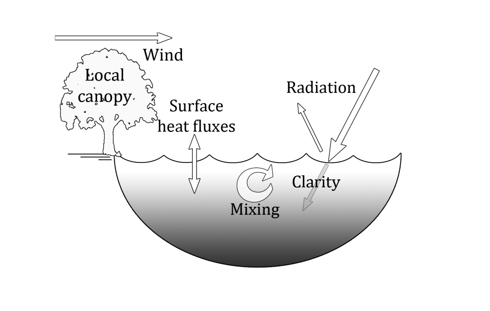
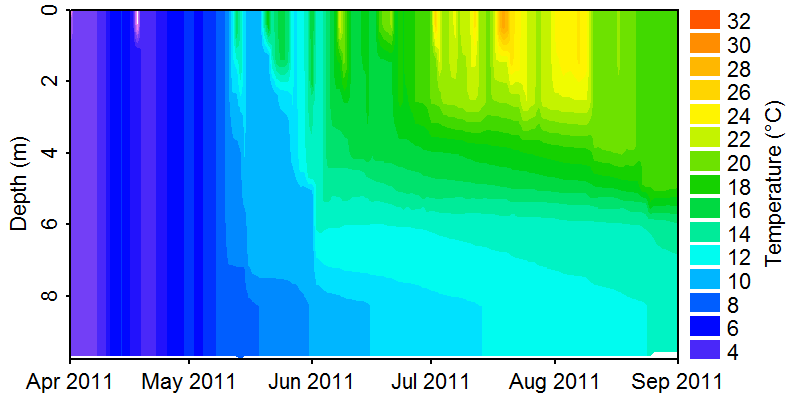
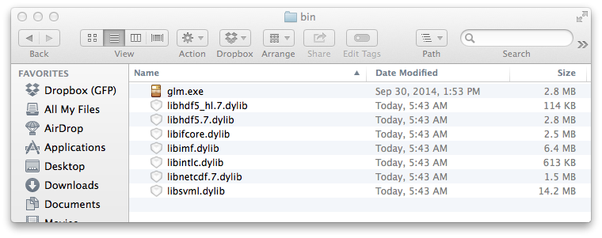
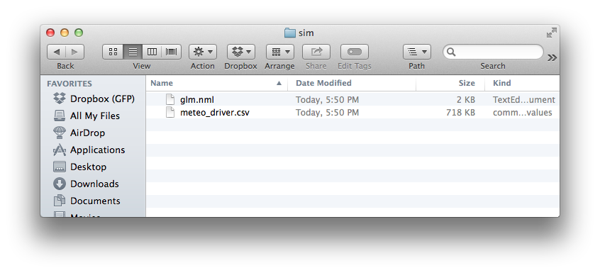
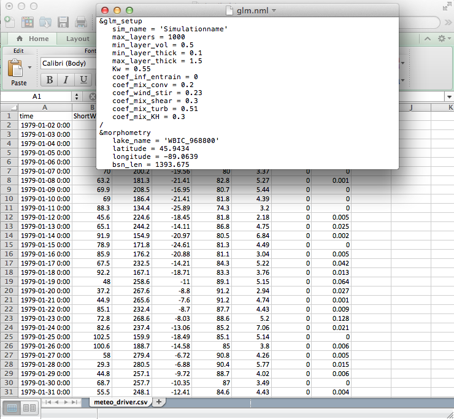
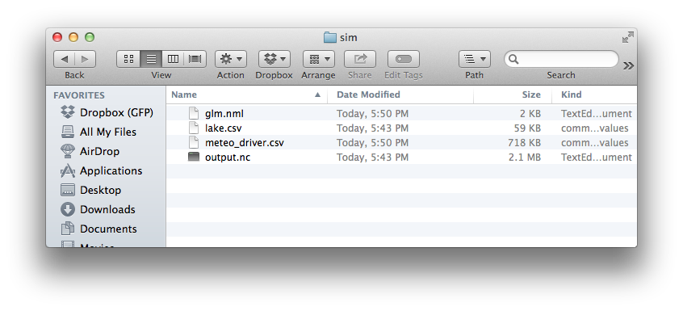

<style type="text/css">
.indent {
  padding-left: 2em !important;
}

.centered {
  width: 100%;
  margin-left: auto;
  margin-right: auto;
  text-align: center;
}

.large {
  font-size: 1.2em !important;
  line-height: 64px !important;
}
.state-background{background:#fff !important;}

.reveal h1,
.reveal h2,
.reveal h3,
.reveal h4,
.reveal h5,
.reveal h6{color:rgb(0,51,102) !important;}

.reveal p,
.reveal li{color:rgb(120,120,120) !important;}

.reveal .controls div.navigate-left,
.reveal .controls div.navigate-left.enabled {
  border-right-color: rgb(0,51,102);
}

.reveal .controls div.navigate-right,
.reveal .controls div.navigate-right.enabled {
  border-left-color: rgb(0,51,102);
}

.reveal .controls div.navigate-left.enabled:hover {
  border-right-color: rgb(150,150,150);
}

.reveal .controls div.navigate-right.enabled:hover {
  border-left-color: rgb(150,150,150);
}

.large a{color:rgb(0,51,102) !important;}

.large a:hover{color:rgb(150,150,150)!important;}
</style>
Lake modeling workshop
========================================================
author: Jordan S Read, Paul C Hanson, Hilary Dugan, Craig Snortheim
font-family: 'Helvetica'
width: 1440
height: 900


GLM overview
====================================
type:sub-section


GLM overview
====================================
type:sub-section


GLM overview
====================================
type:sub-section


GLM overview
====================================
type:sub-section
left: 50%

***



GLM overview
====================================
type:sub-section


GLM results (Craig)
====================================
type:sub-section


Why R?
========================================================
- **Performace**: stable, light and fast
- **Support network** 
 - documentation, community, developers
- **Reproducibility**
 - anyone anywhere can reproduce results
 - enables dissemination - this presentation is a .Rmd file!
- **Versatility**: unified solution to *almost* any numerical problem, graphical capabilities
- **Ethics** removes economic barrier to statistics, is open and democratic

<small>(borrowed from @Robinlovelace)</small>

GLMr
========================================================
type:section

<div class="indent large">GLMr R package</div>
<div class="indent large">Maintainer: Luke A Winslow  </div>
<div class="indent large">Authors: Luke A Winslow, Jordan S Read  </div>
<div class="indent large">Location: <a target="_blank" title="glmtools on github" href="https://github.com/GLEON/GLMr">https://github.com/GLEON/GLMr</a></div>

GLMr holds the current version of the "General Lake Model",  
and can run the model on all platforms (windows, mac, linux)

GLMr
========================================================
incremental: false
type:prompt
left: 50%

<div style="text-align: center; width: 100%;"><span class=large>GLMr Code in R:</span></div>


```r
library(GLMr) 

glm_version()

nml_template_path()
```
***
<div style="text-align: left; width: 100%;"><span class=large>   Explanation</span></div>

 - load the GLMr package in R  

 - get the current version of GLM  
    
 - find the included example glm.nml  

GLMr
========================================================
incremental: false
type:prompt
left: 50%
id: sectionRun

<div style="text-align: center; width: 100%;"><span class=large>GLMr Code in R:</span></div>


```r
run_glm(sim_folder)
```

```r
Reading config from glm.nml
No WQ config
No diffuser data, setting default values
---------------------
| GLM Version 1.4.0 |
---------------------
nDays 32767 timestep 86400.000000
Simulation begins...
Running day  2455806, 100.00% of days complete

---------------------
     Run Complete
```
***
<div style="text-align: left; width: 100%;"><span class=large>   Explanation</span></div>

 - run the GLM model on your computer
 
GLMr
========================================================
incremental: false
type:prompt
left: 60%
<div style="text-align: center; width: 100%;"><span class=large>GLMr Code in R:</span></div>

```r
citation('GLMr')
```

```

To cite GLM in publications use:

  Hipsey, M.R., Bruce, L.C., Hamilton, D.P., 2013. GLM General
  Lake Model. Model Overview and User Information. The University
  of Western Australia Technical Manual, Perth, Australia.

A BibTeX entry for LaTeX users is

  @Article{,
    author = {Matthey R. Hipsey and Louise C. Bruce and David P. Hamilton},
    title = {GLM General Lake Model. Model Overview and User Information},
    journal = {The University of Western Australia Technical Manual, Perth, Australia},
    year = {2013},
  }

As GLM changes, this package will change with it, and the citation
may change too. Find GLM version with 'glm_version()'.
```
***
<div style="text-align: left; width: 100%;"><span class=large>   Explanation</span></div>

 - Get the current citation for GLM
 


glmtools
========================================================
type:section

<div class="indent large">glmtools R package</div>
<div class="indent large">Maintainer: Jordan S Read   </div>
<div class="indent large">Authors: Jordan S Read, Luke A Winslow  </div>
<div class="indent large">Location: <a target="_blank" title="glmtools on github" href="https://github.com/USGS-R/glmtools">https://github.com/USGS-R/glmtools</a></div>

glmtools includes basic functions for calculating physical derivatives and thermal properties of model output, and plotting functionality. glmtools uses GLMr to run GLM

glmtools section 1
========================================================
id: section1
type:sub-section
<span class=large>**Goals**
 - **understand model inputs**  
 - **run model**
 - **visualize results**
  </span>
glmtools model inputs: parameters
========================================================
type:prompt
left: 60%
<div style="text-align: center; width: 100%;"><span class=large>glmtools Code in R:</span></div>

```r
library(glmtools)
```


```r
nml_file <- '../glm_egs/glm.nml'
```


```r
nml <- read_nml(nml_file)
print(nml)
```

```
&glm_setup
   sim_name = 'Simulationname'
   max_layers = 950
   min_layer_vol = 0.5
   min_layer_thick = 0.2
   max_layer_thick = 1.5
   Kw = 0.55
   coef_inf_entrain = 0
   coef_mix_conv = 0.2
   coef_wind_stir = 0.23
   coef_mix_shear = 0.3
   coef_mix_turb = 0.51
   coef_mix_KH = 0.3
/
&morphometry
   lake_name = 'WBIC_968800'
   latitude = 45.94
   longitude = -89.06
   bsn_len = 1394
   bsn_wid = 1394
   bsn_vals = 15
   H = 510.5363, 511.23299, 511.92967, 512.62636, 513.32304, 514.01973, 514.71641, 515.4131, 516.10979, 516.80647, 517.50316, 518.19984, 518.89653, 519.59321, 520.2899
   A = 0, 108.9645, 217.929, 326.8935, 435.858, 544.8225, 653.787, 762.7515, 871.716, 980.6805, 1089.645, 1198.6095, 1307.574, 1416.5385, 1525.503
/
&time
   timefmt = 2
   start = '2011-04-01 00:00:00'
   stop = '2011-09-02 00:00:00'
   dt = 3600
/
&output
   out_dir = '.'
   out_fn = 'output'
   out_lkn = .false.
   nsave = 24
   csv_point_nlevs = 2
   csv_point_fname = 'tempZ_'
   csv_point_at = 2, 1
   csv_point_nvars = 1
   csv_point_vars = 'temp'
   csv_lake_fname = 'lake'
/
&init_profiles
   num_depths = 3
   lake_depth = 9.754
   the_depths = 0, 1.2, 9.7536
   the_temps = 12, 10, 7
   the_sals = 0, 0, 0
/
&meteorology
   met_sw = .true.
   lw_type = 'LW_IN'
   rain_sw = .false.
   snow_sw = .false.
   atm_stab = .true.
   subdaily = .false.
   meteo_fl = 'Anvil_driver.csv'
   wind_factor = 1
   ce = 0.0014
   ch = 0.0014
   coef_wind_drag = 0.00108
/
&inflow
   num_inflows = 0
   names_of_strms = 'GroundWater','stream_2'
   strm_hf_angle = 65
   strmbd_slope = 0.11
   strmbd_drag = 0.016
   inflow_factor = 0.52
   inflow_fl = 'inflow.csv','inflow2.csv'
   inflow_varnum = 2
   inflow_vars = 'FLOW','TEMP'
/
&outflow
   num_outlet = 0
   flt_off_sw = .false.
   outl_elvs = 1
   bsn_len_outl = 799
   bsn_wid_outl = 399
   outflow_fl = 'outflow.csv'
   outflow_factor = 1
/
```
***
<div style="text-align: left; width: 100%;"><span class=large>   Explanation</span></div>

 - load glmtools  
 
 - specify location of glm.nml file  
 
 - read glm.nml file into R  
 
 - print (view) the contents of the nml file


glmtools model inputs: parameters
========================================================
type:prompt
left: 60%
<div style="text-align: center; width: 100%;"><span class=large>glmtools Code in R:</span></div>

```r
get_nml_value(nml,'sim_name')
```

```
[1] "Simulationname"
```

```r
get_nml_value(nml,'Kw')
```

```
[1] 0.55
```
***
<div style="text-align: left; width: 100%;"><span class=large>   Explanation</span></div>

 - get values for specific parameters 

glmtools model inputs: meteorological drivers
========================================================
type:prompt
left: 60%
<div style="text-align: center; width: 100%;"><span class=large>glmtools Code in R:</span></div>


```r
plot_meteo(nml_file)
```

 
***
<div style="text-align: left; width: 100%;"><span class=large>   Explanation</span></div>
 - plot meteorological drivers for simulation
 

glmtools run model
========================================================
type:prompt
left: 60%
<div style="text-align: center; width: 100%;"><span class=large>glmtools Code in R:</span></div>

```r
sim_folder <- '../glm_egs'
```

```r
run_glm(sim_folder)
```

```
[1] 0
```
***
<div style="text-align: left; width: 100%;"><span class=large>   Explanation</span></div>
 - set simulation folder for GLM  
 
 - run GLM model
 
glmtools visualize results
========================================================
type:prompt
left: 60%
<div style="text-align: center; width: 100%;"><span class=large>glmtools Code in R:</span></div>


```r
nc_file <- file.path(sim_folder,'output.nc')
```

```r
plot_temp(file = nc_file, fig_path = FALSE)
```

 
***
<div style="text-align: left; width: 100%;"><span class=large>   Explanation</span></div>
 - set output results file  
 
 - plot water temperatures
 
glmtools section 2
========================================================
id: section2
type:sub-section 
<span class=large>**Goals**
 - **validate/evaluate model outputs**
 - **modify model parameters**  
 - **run simulation with modified parameters**
 </span>
 
glmtools: evaluate model output
========================================================
type:prompt
left: 60%
<div style="text-align: center; width: 100%;"><span class=large>glmtools Code in R:</span></div>

```r
field_file <- '../glm_egs/field_data.tsv'
compare_to_field(nc_file, field_file,
        metric = 'thermo.depth', 
        as_value = TRUE)
```

```
    DateTime   obs   mod
1 2011-05-08 2.403 5.255
2 2011-06-05 6.027 5.551
3 2011-06-28 4.302 4.099
4 2011-07-19 5.334 4.149
5 2011-08-01 5.334 4.163
6 2011-08-15 1.372 5.334
7 2011-08-29 4.796 6.858
```

```r
compare_to_field(nc_file, field_file,
        metric = 'water.temperature', 
        as_value = FALSE)
```

```
[1] 3.031
```
***
<div style="text-align: left; width: 100%;"><span class=large>   Explanation</span></div>
 - set field observations file  
 
 - compare model vs obs for metrics
 
glmtools: modify model parameters
========================================================
type:prompt
left: 60%
<div style="text-align: center; width: 100%;"><span class=large>glmtools Code in R:</span></div>

```r
nml <- set_nml(nml, arg_name = 'Kw', 
          arg_val = 1.05)
```

```r
print(nml)
```

```
&glm_setup
   sim_name = 'Simulationname'
   max_layers = 950
   min_layer_vol = 0.5
   min_layer_thick = 0.2
   max_layer_thick = 1.5
   Kw = 1.05
   coef_inf_entrain = 0
   coef_mix_conv = 0.2
   coef_wind_stir = 0.23
   coef_mix_shear = 0.3
   coef_mix_turb = 0.51
   coef_mix_KH = 0.3
/
&morphometry
   lake_name = 'WBIC_968800'
   latitude = 45.94
   longitude = -89.06
   bsn_len = 1394
   bsn_wid = 1394
   bsn_vals = 15
   H = 510.5363, 511.23299, 511.92967, 512.62636, 513.32304, 514.01973, 514.71641, 515.4131, 516.10979, 516.80647, 517.50316, 518.19984, 518.89653, 519.59321, 520.2899
   A = 0, 108.9645, 217.929, 326.8935, 435.858, 544.8225, 653.787, 762.7515, 871.716, 980.6805, 1089.645, 1198.6095, 1307.574, 1416.5385, 1525.503
/
&time
   timefmt = 2
   start = '2011-04-01 00:00:00'
   stop = '2011-09-02 00:00:00'
   dt = 3600
/
&output
   out_dir = '.'
   out_fn = 'output'
   out_lkn = .false.
   nsave = 24
   csv_point_nlevs = 2
   csv_point_fname = 'tempZ_'
   csv_point_at = 2, 1
   csv_point_nvars = 1
   csv_point_vars = 'temp'
   csv_lake_fname = 'lake'
/
&init_profiles
   num_depths = 3
   lake_depth = 9.754
   the_depths = 0, 1.2, 9.7536
   the_temps = 12, 10, 7
   the_sals = 0, 0, 0
/
&meteorology
   met_sw = .true.
   lw_type = 'LW_IN'
   rain_sw = .false.
   snow_sw = .false.
   atm_stab = .true.
   subdaily = .false.
   meteo_fl = 'Anvil_driver.csv'
   wind_factor = 1
   ce = 0.0014
   ch = 0.0014
   coef_wind_drag = 0.00108
/
&inflow
   num_inflows = 0
   names_of_strms = 'GroundWater','stream_2'
   strm_hf_angle = 65
   strmbd_slope = 0.11
   strmbd_drag = 0.016
   inflow_factor = 0.52
   inflow_fl = 'inflow.csv','inflow2.csv'
   inflow_varnum = 2
   inflow_vars = 'FLOW','TEMP'
/
&outflow
   num_outlet = 0
   flt_off_sw = .false.
   outl_elvs = 1
   bsn_len_outl = 799
   bsn_wid_outl = 399
   outflow_fl = 'outflow.csv'
   outflow_factor = 1
/
```
***
<div style="text-align: left; width: 100%;"><span class=large>   Explanation</span></div>
 - change parameter value  
</br>
 - view nml with change
 
glmtools: re-run simulation
========================================================
type:prompt
left: 60%
<div style="text-align: center; width: 100%;"><span class=large>glmtools Code in R:</span></div>

```r
write_nml(glm_nml = nml, file = nml_file)
```

```r
run_glm(sim_folder)
```

```
[1] 0
```
***
<div style="text-align: left; width: 100%;"><span class=large>   Explanation</span></div>
 - write changed glm.nml to file  
 
 - run GLM model

glmtools: evaluate model output
========================================================
type:prompt
left: 60%
<div style="text-align: center; width: 100%;"><span class=large>glmtools Code in R:</span></div>

```r
field_file <- '../glm_egs/field_data.tsv'
compare_to_field(nc_file, field_file,
        metric = 'thermo.depth', 
        as_value = TRUE)
```

```
    DateTime   obs   mod
1 2011-05-08 2.403 5.476
2 2011-06-05 6.027 4.941
3 2011-06-28 4.302 3.731
4 2011-07-19 5.334 1.372
5 2011-08-01 5.334 3.326
6 2011-08-15 1.372 4.109
7 2011-08-29 4.796 5.894
```

```r
compare_to_field(nc_file, field_file,
        metric = 'water.temperature', 
        as_value = FALSE)
```

```
[1] 3.206
```
***
<div style="text-align: left; width: 100%;"><span class=large>   Explanation</span></div>
 - set field observations file  
 
 - compare model vs obs for metrics

glmtools section 3
========================================================
id: section3
type:sub-section 
<span class=large>**Goals**
 - **address specific questions**
 - **run multi-lake simulations**
 </span>
 
