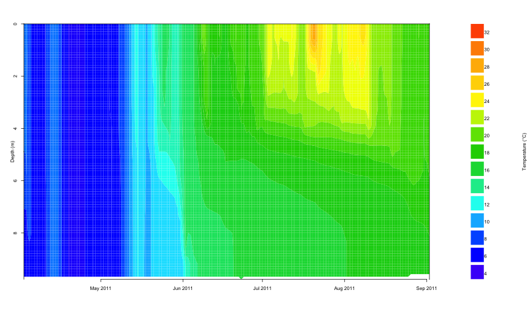

Lake modeling workshop
========================================================
author: Jordan S Read, Paul C Hanson, Hilary Dugan, Craig Snortheim
font-family: 'Helvetica'
width: 1440
height: 900

GLM overview
====================================
id: slide1
type:section

GLM overview
====================================
type:sub-section
more stuff

GLM overview
====================================
type:prompt
more stuff

Why R?
====================================
more stuff

GLMr
========================================================
type:section
GLMr R package  
Maintainer: Luke A Winslow  
Authors: Luke A Winslow, Jordan S Read  
Location: https://github.com/GLEON/glmtools

<small>GLMr holds the current version of the "General Lake Model",  
and can run the model on all platforms (windows, mac, linux)</small>

GLMr
========================================================
incremental: true
type:prompt
load the GLMr package in R

```r
library(GLMr) # 
```
get the current version of GLM

```r
glm_version()
```
find the included example glm.nml

```r
nml_template_path()
```
GLMr
========================================================
incremental: true
type:prompt
run the GLM model on your computer

```r
run_glm(sim_folder)
```
get the current citation for GLM

```r
citation('GLMr')
```

```

To cite GLM in publications use:

  Hipsey, M.R., Bruce, L.C., Hamilton, D.P., 2013. GLM General
  Lake Model. Model Overview and User Information. The University
  of Western Australia Technical Manual, Perth, Australia.

A BibTeX entry for LaTeX users is

  @Article{,
    author = {Matthey R. Hipsey and Louise C. Bruce and David P. Hamilton},
    title = {GLM General Lake Model. Model Overview and User Information},
    journal = {The University of Western Australia Technical Manual, Perth, Australia},
    year = {2013},
  }

As GLM changes, this package will change with it, and the citation
may change too. Find GLM version with 'glm_version()'.
```

glmtools
========================================================
type:section
glmtools R package  
Maintainer: Jordan S Read  
Authors: Jordan S Read, Luke A Winslow  
Location: https://github.com/USGS-R/glmtools

<small>glmtools includes basic functions for calculating physical derivatives and thermal properties of model output, and plotting functionality. glmtools uses GLMr to run GLM</small>


glmtools
========================================================
id: section1
type:sub-section
glmtools section 1  
Goals
 - understand model inputs  
 - run model  
 - visualize results
 
 
glmtools
========================================================
type:prompt

```r
library(glmtools)
```


```r
nml_file <- '../glm_egs/glm.nml'

plot_meteo(nml_file, fig_path = FALSE)
```

 

glmtools
========================================================
type:prompt
incremental: true

```r
nml <- read_nml(nml_file)
print(nml)
```

```
&glm_setup
   sim_name = 'Simulationname'
   max_layers = 950
   min_layer_vol = 0.5
   min_layer_thick = 0.2
   max_layer_thick = 1.5
   Kw = 0.55
   coef_inf_entrain = 0
   coef_mix_conv = 0.2
   coef_wind_stir = 0.23
   coef_mix_shear = 0.3
   coef_mix_turb = 0.51
   coef_mix_KH = 0.3
/
&morphometry
   lake_name = 'WBIC_968800'
   latitude = 45.94
   longitude = -89.06
   bsn_len = 1394
   bsn_wid = 1394
   bsn_vals = 15
   H = 510.5363, 511.23299, 511.92967, 512.62636, 513.32304, 514.01973, 514.71641, 515.4131, 516.10979, 516.80647, 517.50316, 518.19984, 518.89653, 519.59321, 520.2899
   A = 0, 108.9645, 217.929, 326.8935, 435.858, 544.8225, 653.787, 762.7515, 871.716, 980.6805, 1089.645, 1198.6095, 1307.574, 1416.5385, 1525.503
/
&time
   timefmt = 2
   start = '2011-04-01 00:00:00'
   stop = '2011-09-02 00:00:00'
   dt = 86400
/
&output
   out_dir = '.'
   out_fn = 'output'
   out_lkn = .false.
   nsave = 1
   csv_point_nlevs = 2
   csv_point_fname = 'tempZ_'
   csv_point_at = 2, 1
   csv_point_nvars = 1
   csv_point_vars = 'temp'
   csv_lake_fname = 'lake'
/
&init_profiles
   num_depths = 3
   lake_depth = 9.754
   the_depths = 0, 1.2, 9.7536
   the_temps = 12, 10, 7
   the_sals = 0, 0, 0
/
&meteorology
   met_sw = .true.
   lw_type = 'LW_IN'
   rain_sw = .false.
   snow_sw = .false.
   atm_stab = .true.
   subdaily = .true.
   meteo_fl = 'Anvil_driver.csv'
   wind_factor = 1
   ce = 0.0014
   ch = 0.0014
   coef_wind_drag = 0.00108
/
&inflow
   num_inflows = 0
   names_of_strms = 'GroundWater','stream_2'
   strm_hf_angle = 65
   strmbd_slope = 0.11
   strmbd_drag = 0.016
   inflow_factor = 0.52
   inflow_fl = 'inflow.csv','inflow2.csv'
   inflow_varnum = 2
   inflow_vars = 'FLOW','TEMP'
/
&outflow
   num_outlet = 0
   flt_off_sw = .false.
   outl_elvs = 1
   bsn_len_outl = 799
   bsn_wid_outl = 399
   outflow_fl = 'outflow.csv'
   outflow_factor = 1
/
```

glmtools
========================================================
type:prompt
incremental: true

```r
get_nml_value(nml,'sim_name')
```

```
[1] "Simulationname"
```

```r
get_nml_value(nml,'Kw')
```

```
[1] 0.55
```
glmtools
========================================================
type:prompt
incremental: false

```r
sim_folder <- '../glm_egs'
run_glm(sim_folder)
```

```
[1] 0
```

```r
nc_file <- file.path(sim_folder,'output.nc')
plot_temp(file = nc_file, fig_path = FALSE)
```

 

glmtools
========================================================
id: section2
type:sub-section
glmtools section 2  
Goals
 - validate/evaluate model outputs
 - modify model parameters  
 - run simulation with modified parameters
 
 
glmtools
========================================================
type:prompt
incremental: true

```r
field_file <- '../glm_egs/field_data.tsv'

compare_to_field(nc_file, field_file,
                 metric = 'thermo.depth', 
                 as_value = TRUE)
```

```
    DateTime   obs   mod
1 2011-05-08 2.403 1.372
2 2011-06-05 6.027 6.858
3 2011-06-28 4.302 3.504
4 2011-07-19 5.334 3.829
5 2011-08-01 5.334 4.235
6 2011-08-15 1.372 5.334
7 2011-08-29 4.796 6.858
```

```r
compare_to_field(nc_file, field_file,
                 metric = 'water.temperature', 
                 as_value = FALSE)
```

```
[1] 4.044
```
glmtools
========================================================
type:prompt
incremental: true

```r
nml <- set_nml(nml, arg_name = 'Kw', 
               arg_val = 1.05)
```

```r
nml <- set_nml(nml, arg_name = 'min_layer_thick',
               arg_val = 0.15)
```

```r
print(nml)
```

```
&glm_setup
   sim_name = 'Simulationname'
   max_layers = 950
   min_layer_vol = 0.5
   min_layer_thick = 0.15
   max_layer_thick = 1.5
   Kw = 1.05
   coef_inf_entrain = 0
   coef_mix_conv = 0.2
   coef_wind_stir = 0.23
   coef_mix_shear = 0.3
   coef_mix_turb = 0.51
   coef_mix_KH = 0.3
/
&morphometry
   lake_name = 'WBIC_968800'
   latitude = 45.94
   longitude = -89.06
   bsn_len = 1394
   bsn_wid = 1394
   bsn_vals = 15
   H = 510.5363, 511.23299, 511.92967, 512.62636, 513.32304, 514.01973, 514.71641, 515.4131, 516.10979, 516.80647, 517.50316, 518.19984, 518.89653, 519.59321, 520.2899
   A = 0, 108.9645, 217.929, 326.8935, 435.858, 544.8225, 653.787, 762.7515, 871.716, 980.6805, 1089.645, 1198.6095, 1307.574, 1416.5385, 1525.503
/
&time
   timefmt = 2
   start = '2011-04-01 00:00:00'
   stop = '2011-09-02 00:00:00'
   dt = 86400
/
&output
   out_dir = '.'
   out_fn = 'output'
   out_lkn = .false.
   nsave = 1
   csv_point_nlevs = 2
   csv_point_fname = 'tempZ_'
   csv_point_at = 2, 1
   csv_point_nvars = 1
   csv_point_vars = 'temp'
   csv_lake_fname = 'lake'
/
&init_profiles
   num_depths = 3
   lake_depth = 9.754
   the_depths = 0, 1.2, 9.7536
   the_temps = 12, 10, 7
   the_sals = 0, 0, 0
/
&meteorology
   met_sw = .true.
   lw_type = 'LW_IN'
   rain_sw = .false.
   snow_sw = .false.
   atm_stab = .true.
   subdaily = .true.
   meteo_fl = 'Anvil_driver.csv'
   wind_factor = 1
   ce = 0.0014
   ch = 0.0014
   coef_wind_drag = 0.00108
/
&inflow
   num_inflows = 0
   names_of_strms = 'GroundWater','stream_2'
   strm_hf_angle = 65
   strmbd_slope = 0.11
   strmbd_drag = 0.016
   inflow_factor = 0.52
   inflow_fl = 'inflow.csv','inflow2.csv'
   inflow_varnum = 2
   inflow_vars = 'FLOW','TEMP'
/
&outflow
   num_outlet = 0
   flt_off_sw = .false.
   outl_elvs = 1
   bsn_len_outl = 799
   bsn_wid_outl = 399
   outflow_fl = 'outflow.csv'
   outflow_factor = 1
/
```

glmtools
========================================================
type:prompt
incremental: true

```r
write_nml(glm_nml = nml, file = nml_file)
```

```r
run_glm(sim_folder)
```

```
[1] 0
```
glmtools
========================================================
type:prompt
incremental: true

```r
compare_to_field(nc_file, field_file,
                 metric = 'thermo.depth', 
                 as_value = TRUE)
```

```
    DateTime   obs   mod
1 2011-05-08 2.403 5.510
2 2011-06-05 6.027 1.846
3 2011-06-28 4.302 2.598
4 2011-07-19 5.334 3.317
5 2011-08-01 5.334 2.715
6 2011-08-15 1.372 4.216
7 2011-08-29 4.796 5.745
```

```r
compare_to_field(nc_file, field_file,
                 metric = 'water.temperature', 
                 as_value = FALSE)
```

```
[1] 4.232
```

glmtools
========================================================
id: section3
type:sub-section
## glmtools section 3  
### Goals
 - ??  
 - ??  
 - run multi-lake simulations
 
 
glmtools
========================================================
type:prompt

